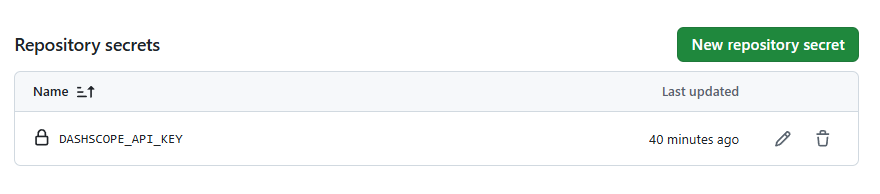

  <h1 align="center"> <ins>Red-Team-Arxiv-Paper-Update-With-AI-Summary</ins> 使用 GitHub Actions 每日自动更新LLM越狱论文</h1>
 

## 概览

该代码库由以下部分组成：

- `daily_arxiv.py`：根据给定配置处理的主脚本
- `config.yaml`：论文关键词等的配置文件

## 使用方法

  
目录

1. Fork 此 [仓库](https://github.com/Vincentqyw/cv-arxiv-daily)
2. 修改配置：
    - 在 [cv-arxiv-daily.yml](../.github/workflows/cv-arxiv-daily.yml) 与 [update_paper_links.yml](../.github/workflows/update_paper_links.yml) 中修改 `GITHUB_USER_NAME` 与 `GITHUB_USER_EMAIL`
    - 在 [config.yaml](../config.yaml) 中修改 `user_name`
    - 将修改推送至远程仓库
3. 配置 GitHub Actions
    - 启用读写权限：Setting -> Actions -> Workflow permissions，选择 `Read and write permissions` 并保存。
    
    - 启用工作流：Actions -> `I understand my workflows, go ahead and enable them` -> 在右侧栏选择 `Run Arxiv Papars Daily` 并点击 `Enable workflow` -> 点击 `Run workflow`，等待约 1 分钟直到任务更新完成。`Run Update Paper Links Weekly` 任务同理。
    
    
    
    
    
4. 配置千问模型访问凭据 DASHSCOPE_API_KEY
    - 在仓库里，进入 Settings -> Secrets and variables -> Actions -> New repository secret
    - 创建一个secret，名字叫做`DASHSCOPE_API_KEY`并且将value值设置为你的千问模型访问凭据
    
    - 此时workflow就会将它导出到工作环境里
5. 配置 GitHub Pages（可选）
    - Setting -> Pages -> Build and deployment。Source 选择 `Deploy from a branch`；Branch 选择 `main` 和 `/docs` 目录，然后保存。
    
    - 现在可以访问站点：`https://your_github_usrname.github.io/cv-arxiv-daily`
6. 添加新关键词（可选）
    - 在 [config.yaml](../config.yaml) 中编辑 `keywords`，可添加更多过滤条件或关键词。
    - 将修改推送至远程仓库并手动重新运行 GitHub Actions。

## 发布计划

我们仍在逐步开放完整能力，规划如下：

- [x] 配置文件
- [x] 更新代码链接
- [ ] 订阅与更新提醒
- [ ] 支持更多 `arxiv` 过滤器
- [ ] 归档旧论文
- [ ] 语言翻译（[`ChatGPT`](https://chat.openai.com/chat)）
- [ ] 有用的注释
- [ ] ...
